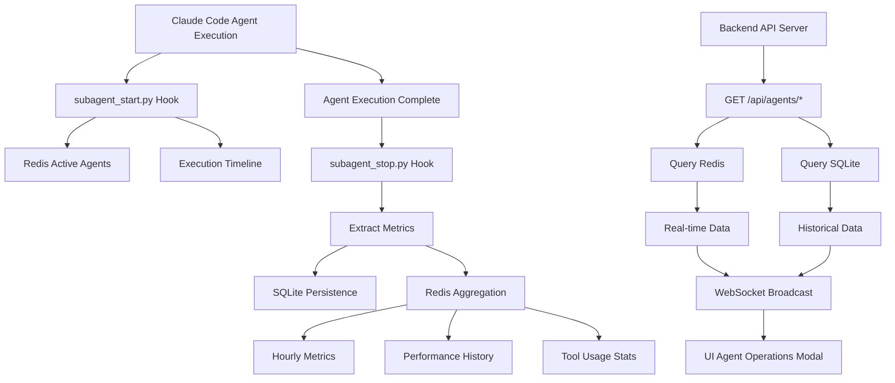

# Agent Operations Backend Architecture

## Overview
Comprehensive backend architecture for capturing, aggregating, and serving real-time agent execution metrics to power the Agent Operations modal in the observability dashboard.

## Architecture Components

### 1. Enhanced Hook System for Metrics Capture

#### 1.1 Enhanced subagent_stop.py Hook
The existing `subagent_stop.py` hook will be enhanced to capture and send comprehensive metrics to both SQLite (for persistence) and Redis (for real-time aggregation).

**Key Enhancements:**
```python
# Enhanced agent metadata extraction
agent_metadata = {
    "agent_id": generate_agent_id(),  # Unique execution ID
    "agent_name": "screenshot-analyzer",
    "agent_type": "analyzer",  # Classified by name patterns
    "execution_start": start_timestamp,
    "execution_end": end_timestamp,
    "duration_ms": duration_in_milliseconds,
    "status": "success" | "failure" | "timeout",
    "error_details": {
        "type": "ValidationError",
        "message": "Failed to process image",
        "stack_trace": "..."
    },
    "tools_used": ["Read", "Write", "Bash"],
    "tool_calls": {
        "Read": 5,
        "Write": 2,
        "Bash": 3
    },
    "token_usage": {
        "input_tokens": 1500,
        "output_tokens": 2300,
        "total_tokens": 3800,
        "estimated_cost": 0.0076  # Based on model pricing
    },
    "performance_metrics": {
        "response_time_ms": 1234,
        "memory_usage_mb": 45.2,
        "cpu_usage_percent": 23.5
    },
    "task_metadata": {
        "description": "Analyze screenshot for UI components",
        "source": "user_command" | "auto_activation" | "wave_orchestration",
        "parent_task_id": "parent_123",  # For nested agents
        "wave_number": 3  # If part of wave orchestration
    },
    "output_metrics": {
        "files_created": 2,
        "files_modified": 5,
        "lines_added": 150,
        "lines_removed": 30,
        "tests_passed": 12,
        "tests_failed": 0
    }
}
```

#### 1.2 New subagent_start.py Hook
Create a new hook to capture agent start events:

```python
#!/usr/bin/env -S uv run --script
# /// script
# requires-python = ">=3.11"
# dependencies = [
#     "redis>=4.0.0",
#     "python-dotenv",
# ]
# ///

import json
import sys
import redis
from datetime import datetime
from typing import Dict, Any

def capture_agent_start(input_data: Dict[str, Any]):
    """Capture agent execution start and store in Redis."""
    r = redis.Redis(host='localhost', port=6379, decode_responses=True)
    
    agent_id = generate_unique_id()
    start_data = {
        "agent_id": agent_id,
        "agent_name": extract_agent_name(input_data),
        "start_time": datetime.now().isoformat(),
        "task_description": input_data.get("task", ""),
        "tools_granted": input_data.get("tools", []),
        "context_size": len(json.dumps(input_data))
    }
    
    # Store in Redis with TTL
    r.setex(
        f"agent:active:{agent_id}",
        300,  # 5 minute TTL for active agents
        json.dumps(start_data)
    )
    
    # Add to active agents set
    r.sadd("agents:active", agent_id)
    
    # Store start event for timeline
    r.zadd(
        "agents:timeline",
        {agent_id: datetime.now().timestamp()}
    )
    
    return agent_id
```

### 2. Redis Data Structures for Real-time Metrics

#### 2.1 Active Agent Tracking
```redis
# Currently executing agents
SET agents:active
- Contains agent_ids of currently running agents

# Individual active agent data
STRING agent:active:{agent_id}
- JSON with start time, name, task description
- TTL: 5 minutes (auto-cleanup for hung agents)

# Agent execution timeline
SORTED SET agents:timeline
- Score: timestamp
- Member: agent_id
- Used for execution timeline visualization
```

#### 2.2 Metrics Aggregation
```redis
# Hourly metrics per agent type
HASH metrics:hourly:{YYYY-MM-DD-HH}:{agent_type}
- execution_count: 42
- success_count: 40
- failure_count: 2
- total_duration_ms: 125000
- avg_duration_ms: 2976
- total_tokens: 159600
- avg_tokens: 3800
- total_cost: 0.3192

# Daily rollup
HASH metrics:daily:{YYYY-MM-DD}
- total_executions: 1250
- success_rate: 0.96
- agent_types: ["analyzer", "debugger", "reviewer"]
- peak_hour: 14
- total_tokens: 4750000
- total_cost: 9.50

# Tool usage distribution
SORTED SET tools:usage:{YYYY-MM-DD}
- Score: usage count
- Member: tool name
```

#### 2.3 Performance History
```redis
# Agent performance history (rolling 7 days)
LIST agent:history:{agent_name}
- JSON objects with execution metrics
- Trimmed to last 100 executions

# Performance percentiles
SORTED SET agent:performance:{agent_name}:duration
- Score: duration_ms
- Member: agent_id
- Used for P50, P95, P99 calculations

# Error tracking
LIST agent:errors:{agent_name}
- JSON error details
- Last 50 errors per agent type
```

### 3. Backend API Endpoints

#### 3.1 Real-time Agent Metrics
```typescript
// GET /api/agents/metrics/current
{
  "active_agents": 3,
  "executions_today": 125,
  "success_rate": 0.96,
  "avg_duration_ms": 2340,
  "tokens_used_today": 475000,
  "estimated_cost_today": 0.95,
  "active_agent_details": [
    {
      "agent_id": "ag_123",
      "agent_name": "screenshot-analyzer",
      "status": "running",
      "duration_so_far_ms": 1234,
      "progress": 0.45  // If available
    }
  ]
}

// GET /api/agents/metrics/timeline?hours=24
{
  "timeline": [
    {
      "timestamp": "2025-01-06T10:00:00Z",
      "executions": 15,
      "avg_duration_ms": 2100,
      "success_rate": 0.93,
      "dominant_agent_type": "analyzer"
    }
  ]
}
```

#### 3.2 Agent Type Breakdown
```typescript
// GET /api/agents/types/distribution
{
  "distribution": [
    {
      "type": "analyzer",
      "count": 45,
      "percentage": 0.36,
      "avg_duration_ms": 2340,
      "success_rate": 0.96,
      "common_tools": ["Read", "Grep", "Bash"]
    },
    {
      "type": "debugger",
      "count": 30,
      "percentage": 0.24,
      "avg_duration_ms": 4500,
      "success_rate": 0.90,
      "common_tools": ["Read", "Edit", "Bash", "Grep"]
    }
  ]
}
```

#### 3.3 Historical Performance
```typescript
// GET /api/agents/performance/{agent_name}?days=7
{
  "agent_name": "screenshot-analyzer",
  "total_executions": 315,
  "success_rate": 0.97,
  "performance": {
    "p50_duration_ms": 2100,
    "p95_duration_ms": 4500,
    "p99_duration_ms": 8900,
    "min_duration_ms": 800,
    "max_duration_ms": 12000
  },
  "token_usage": {
    "avg_tokens": 3800,
    "total_tokens": 1197000,
    "estimated_cost": 2.39
  },
  "daily_trend": [
    {
      "date": "2025-01-06",
      "executions": 45,
      "avg_duration_ms": 2200,
      "success_rate": 0.98
    }
  ]
}
```

#### 3.4 Tool Usage Analytics
```typescript
// GET /api/agents/tools/usage?period=day
{
  "period": "2025-01-06",
  "tools": [
    {
      "name": "Read",
      "usage_count": 234,
      "percentage": 0.28,
      "avg_per_execution": 1.87,
      "agents_using": ["analyzer", "debugger", "reviewer"]
    },
    {
      "name": "Edit",
      "usage_count": 156,
      "percentage": 0.19,
      "avg_per_execution": 1.25,
      "agents_using": ["debugger", "refactorer"]
    }
  ],
  "insights": {
    "most_used_tool": "Read",
    "least_used_tool": "NotebookEdit",
    "high_correlation": [
      ["Read", "Edit"],  // Often used together
      ["Grep", "Glob"]
    ]
  }
}
```

### 4. Data Flow Architecture



### 5. Implementation Steps

#### Phase 1: Hook Enhancement (Day 1)
1. Create `subagent_start.py` hook
2. Enhance `subagent_stop.py` with comprehensive metrics
3. Add Redis client to hook dependencies
4. Implement metric extraction logic

#### Phase 2: Redis Structure (Day 1-2)
1. Set up Redis data structures
2. Implement aggregation logic
3. Create cleanup scripts for expired data
4. Add Redis connection pooling

#### Phase 3: API Endpoints (Day 2-3)
1. Create agent metrics routes
2. Implement aggregation queries
3. Add caching layer
4. Set up WebSocket broadcasting

#### Phase 4: Integration (Day 3-4)
1. Update hooks installation script
2. Test end-to-end data flow
3. Add monitoring and alerting
4. Performance optimization

### 6. Performance Considerations

#### Caching Strategy
- Cache current metrics for 5 seconds
- Cache hourly aggregates for 5 minutes
- Cache daily stats for 1 hour
- Use Redis as primary cache

#### Data Retention
- Active agent data: 5 minutes
- Hourly metrics: 7 days
- Daily rollups: 90 days
- Agent history: Last 100 executions
- Error logs: Last 50 per agent type

#### Scalability
- Redis Cluster for high throughput
- Read replicas for analytics queries
- Async processing for heavy aggregations
- Batch writes for SQLite persistence

### 7. Monitoring & Alerting

#### Key Metrics to Monitor
- Agent execution rate
- Success/failure rates
- Average duration trends
- Token usage spikes
- Cost accumulation
- Active agent count
- Redis memory usage
- API response times

#### Alert Conditions
- Success rate < 80% (5 min window)
- Average duration > 2x baseline
- Token usage > daily budget
- Active agents > 10 (possible runaway)
- Redis memory > 80%
- API latency > 500ms

### 8. Security Considerations

#### Data Sanitization
- Strip sensitive data from error messages
- Anonymize user-specific information
- Mask API keys and credentials
- Limit stack trace exposure

#### Access Control
- API key authentication for endpoints
- Rate limiting per client
- CORS configuration
- WebSocket authentication

### 9. Example Enhanced Hook Integration

```python
# In subagent_stop.py, add Redis metrics push

def push_metrics_to_redis(agent_metadata: Dict[str, Any]):
    """Push agent metrics to Redis for aggregation."""
    r = redis.Redis(host='localhost', port=6379, decode_responses=True)
    
    # Remove from active agents
    agent_id = agent_metadata.get('agent_id')
    r.srem('agents:active', agent_id)
    r.delete(f'agent:active:{agent_id}')
    
    # Update hourly metrics
    hour_key = f"metrics:hourly:{datetime.now().strftime('%Y-%m-%d-%H')}:{agent_metadata['agent_type']}"
    pipe = r.pipeline()
    pipe.hincrby(hour_key, 'execution_count', 1)
    pipe.hincrby(hour_key, f"{agent_metadata['status']}_count", 1)
    pipe.hincrby(hour_key, 'total_duration_ms', agent_metadata['duration_ms'])
    pipe.hincrby(hour_key, 'total_tokens', agent_metadata['token_usage']['total_tokens'])
    pipe.hincrbyfloat(hour_key, 'total_cost', agent_metadata['token_usage']['estimated_cost'])
    pipe.expire(hour_key, 7 * 24 * 3600)  # 7 days TTL
    pipe.execute()
    
    # Update tool usage
    for tool, count in agent_metadata['tool_calls'].items():
        r.zincrby(f"tools:usage:{datetime.now().strftime('%Y-%m-%d')}", count, tool)
    
    # Store in performance history
    history_key = f"agent:history:{agent_metadata['agent_name']}"
    r.lpush(history_key, json.dumps(agent_metadata))
    r.ltrim(history_key, 0, 99)  # Keep last 100
    
    # Update performance percentiles
    perf_key = f"agent:performance:{agent_metadata['agent_name']}:duration"
    r.zadd(perf_key, {agent_id: agent_metadata['duration_ms']})
    
    # Broadcast via WebSocket
    broadcast_agent_update(agent_metadata)
```

### 10. Testing Strategy

#### Unit Tests
- Hook metric extraction logic
- Redis aggregation functions
- API endpoint responses
- WebSocket message formatting

#### Integration Tests
- End-to-end agent execution tracking
- Redis data persistence
- API to UI data flow
- WebSocket real-time updates

#### Load Tests
- 100+ concurrent agent executions
- Redis memory under load
- API response times under stress
- WebSocket connection limits

## Conclusion

This architecture provides a robust, scalable solution for capturing and serving comprehensive agent metrics. It leverages existing infrastructure while adding powerful real-time analytics capabilities through Redis aggregation and enhanced hook integration.

The system is designed to handle high throughput while maintaining sub-second response times for the UI, enabling rich visualizations in the Agent Operations modal including:
- Real-time agent execution status
- Historical performance trends
- Tool usage patterns
- Cost tracking
- Error analysis
- Agent type distribution

The phased implementation approach ensures minimal disruption to existing systems while progressively adding value through each phase.