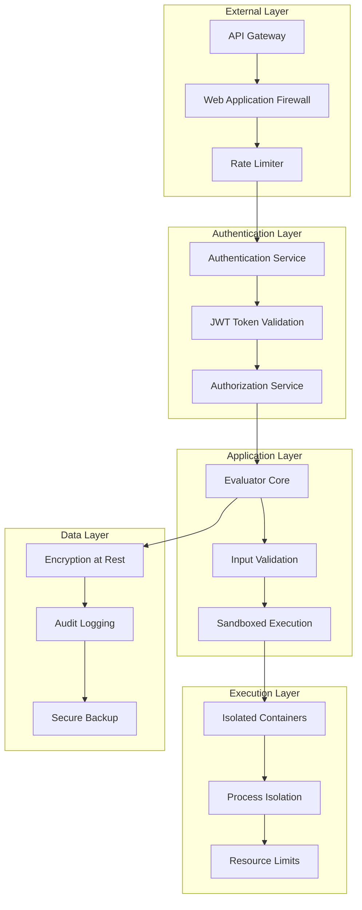

# MCP Testing Evaluation Framework - Security Best Practices

**Comprehensive security documentation for secure deployment and operation of the MCP Testing Evaluation Framework**

## Table of Contents

1. [Security Architecture Overview](#security-architecture-overview)
2. [Authentication & Authorization](#authentication--authorization)
3. [Input Validation & Sanitization](#input-validation--sanitization)
4. [Sandboxing & Isolation](#sandboxing--isolation)
5. [Vulnerability Prevention](#vulnerability-prevention)
6. [Security Testing Procedures](#security-testing-procedures)
7. [Incident Response](#incident-response)
8. [Compliance Guidelines](#compliance-guidelines)

## Security Architecture Overview

The MCP Testing Evaluation Framework implements defense-in-depth security principles to protect against various threat vectors while maintaining functional evaluation capabilities.

### Security Model



### Threat Model

| Threat Category | Risk Level | Mitigation Strategy |
|----------------|------------|-------------------|
| **Code Injection** | High | Input sanitization, sandboxing |
| **Path Traversal** | High | Path validation, chroot isolation |
| **DoS Attacks** | Medium | Rate limiting, resource constraints |
| **Data Exfiltration** | Medium | Network isolation, audit logging |
| **Privilege Escalation** | High | Least privilege, container isolation |
| **Supply Chain** | Medium | Dependency scanning, integrity checks |

### Security Principles

1. **Least Privilege**: Minimal permissions for all components
2. **Defense in Depth**: Multiple security layers
3. **Fail Secure**: Default deny policies
4. **Zero Trust**: Verify all interactions
5. **Incident Response**: Rapid detection and response

## Authentication & Authorization

### Authentication Methods

#### 1. API Key Authentication

**Production Configuration**:
```javascript
// config/security.js
const securityConfig = {
  authentication: {
    methods: ['api-key', 'jwt'],
    apiKey: {
      algorithm: 'HS256',
      keyRotation: 30 * 24 * 60 * 60 * 1000, // 30 days
      hashIterations: 100000,
      saltLength: 32
    },
    jwt: {
      algorithm: 'RS256',
      expiresIn: '1h',
      refreshThreshold: 15 * 60 * 1000, // 15 minutes
      issuer: 'mcp-evaluator',
      audience: 'mcp-api'
    }
  }
};
```

**Secure API Key Generation**:
```javascript
const crypto = require('crypto');

class SecureAPIKeyManager {
  constructor() {
    this.algorithm = 'aes-256-gcm';
    this.keyDerivation = 'pbkdf2';
  }
  
  generateAPIKey(userId) {
    // Generate cryptographically secure random key
    const keyBytes = crypto.randomBytes(32);
    const salt = crypto.randomBytes(16);
    const timestamp = Date.now();
    
    // Create key identifier
    const keyId = crypto.randomBytes(8).toString('hex');
    
    // Derive encryption key from master secret
    const derivedKey = crypto.pbkdf2Sync(
      process.env.MASTER_SECRET,
      salt,
      100000,
      32,
      'sha256'
    );
    
    // Encrypt the key data
    const cipher = crypto.createCipher(this.algorithm, derivedKey);
    const iv = crypto.randomBytes(12);
    cipher.setIV(iv);
    
    const keyData = Buffer.concat([
      Buffer.from(userId, 'utf8'),
      Buffer.from(timestamp.toString(), 'utf8'),
      keyBytes
    ]);
    
    const encrypted = Buffer.concat([
      cipher.update(keyData),
      cipher.final()
    ]);
    
    const authTag = cipher.getAuthTag();
    
    // Combine components
    const apiKey = Buffer.concat([
      Buffer.from(keyId, 'hex'),
      salt,
      iv,
      authTag,
      encrypted
    ]).toString('base64url');
    
    return {
      keyId,
      apiKey: `mcp_${apiKey}`,
      expiresAt: new Date(timestamp + 30 * 24 * 60 * 60 * 1000)
    };
  }
  
  validateAPIKey(apiKey) {
    try {
      if (!apiKey.startsWith('mcp_')) {
        throw new Error('Invalid key format');
      }
      
      const keyData = Buffer.from(apiKey.substring(4), 'base64url');
      
      const keyId = keyData.subarray(0, 8).toString('hex');
      const salt = keyData.subarray(8, 24);
      const iv = keyData.subarray(24, 36);
      const authTag = keyData.subarray(36, 52);
      const encrypted = keyData.subarray(52);
      
      // Derive decryption key
      const derivedKey = crypto.pbkdf2Sync(
        process.env.MASTER_SECRET,
        salt,
        100000,
        32,
        'sha256'
      );
      
      // Decrypt
      const decipher = crypto.createDecipher(this.algorithm, derivedKey);
      decipher.setIV(iv);
      decipher.setAuthTag(authTag);
      
      const decrypted = Buffer.concat([
        decipher.update(encrypted),
        decipher.final()
      ]);
      
      // Extract user ID and timestamp
      const userId = decrypted.subarray(0, 36).toString('utf8').replace(/\0+$/, '');
      const timestamp = parseInt(decrypted.subarray(36, 49).toString('utf8'));
      
      // Check expiration
      if (Date.now() > timestamp + 30 * 24 * 60 * 60 * 1000) {
        throw new Error('API key expired');
      }
      
      return { userId, keyId, issuedAt: new Date(timestamp) };
      
    } catch (error) {
      throw new Error(`API key validation failed: ${error.message}`);
    }
  }
}
```

#### 2. JWT Authentication

**JWT Implementation with Security Best Practices**:
```javascript
const jwt = require('jsonwebtoken');
const fs = require('fs');

class SecureJWTManager {
  constructor() {
    // Load RSA keys (generated separately)
    this.privateKey = fs.readFileSync(process.env.JWT_PRIVATE_KEY_PATH);
    this.publicKey = fs.readFileSync(process.env.JWT_PUBLIC_KEY_PATH);
    
    this.algorithm = 'RS256';
    this.issuer = 'mcp-evaluator';
    this.audience = 'mcp-api';
  }
  
  generateToken(payload) {
    const now = Math.floor(Date.now() / 1000);
    
    const tokenPayload = {
      ...payload,
      iss: this.issuer,
      aud: this.audience,
      iat: now,
      exp: now + (60 * 60), // 1 hour
      nbf: now,
      jti: crypto.randomUUID(), // Unique token ID
    };
    
    return jwt.sign(tokenPayload, this.privateKey, {
      algorithm: this.algorithm,
      header: {
        typ: 'JWT',
        alg: this.algorithm,
        kid: process.env.JWT_KEY_ID
      }
    });
  }
  
  verifyToken(token) {
    try {
      const decoded = jwt.verify(token, this.publicKey, {
        algorithms: [this.algorithm],
        issuer: this.issuer,
        audience: this.audience,
        clockTolerance: 30 // 30 second clock skew tolerance
      });
      
      // Additional security checks
      this.validateTokenSecurity(decoded, token);
      
      return decoded;
    } catch (error) {
      throw new Error(`Token validation failed: ${error.message}`);
    }
  }
  
  validateTokenSecurity(payload, token) {
    // Check token blacklist
    if (this.isTokenBlacklisted(payload.jti)) {
      throw new Error('Token has been revoked');
    }
    
    // Validate scopes
    if (!payload.scopes || !Array.isArray(payload.scopes)) {
      throw new Error('Invalid or missing scopes');
    }
    
    // Rate limit per user
    this.enforceUserRateLimit(payload.sub);
  }
  
  revokeToken(jti) {
    // Add to blacklist with expiration
    this.blacklistToken(jti);
  }
}
```

### Authorization Framework

#### Role-Based Access Control (RBAC)

```javascript
// Security roles and permissions
const PERMISSIONS = {
  // Evaluation permissions
  'evaluate:read': 'View evaluations and results',
  'evaluate:create': 'Start new evaluations',
  'evaluate:cancel': 'Cancel running evaluations',
  'evaluate:delete': 'Delete evaluation results',
  
  // System permissions
  'system:config': 'Modify system configuration',
  'system:metrics': 'Access system metrics',
  'system:health': 'Access health endpoints',
  
  // User management
  'users:read': 'View user information',
  'users:write': 'Modify user information',
  'users:admin': 'Full user administration',
  
  // Hook management
  'hooks:read': 'View hook configurations',
  'hooks:write': 'Modify hook configurations',
  'hooks:execute': 'Execute custom hooks',
};

const ROLES = {
  'viewer': {
    permissions: [
      'evaluate:read',
      'system:health'
    ]
  },
  'evaluator': {
    permissions: [
      'evaluate:read',
      'evaluate:create',
      'evaluate:cancel',
      'system:health',
      'system:metrics'
    ]
  },
  'administrator': {
    permissions: Object.keys(PERMISSIONS)
  },
  'service': {
    permissions: [
      'evaluate:read',
      'evaluate:create',
      'system:health'
    ],
    restrictions: {
      rateLimit: {
        requests: 1000,
        window: 3600000 // 1 hour
      },
      ipWhitelist: process.env.SERVICE_IP_WHITELIST?.split(',') || []
    }
  }
};

class AuthorizationService {
  constructor() {
    this.permissions = PERMISSIONS;
    this.roles = ROLES;
  }
  
  hasPermission(userRoles, requiredPermission) {
    for (const role of userRoles) {
      if (this.roles[role]?.permissions.includes(requiredPermission)) {
        return true;
      }
    }
    return false;
  }
  
  enforcePermission(userRoles, requiredPermission) {
    if (!this.hasPermission(userRoles, requiredPermission)) {
      throw new Error(`Insufficient permissions: ${requiredPermission} required`);
    }
  }
  
  checkResourceAccess(userId, resourceType, resourceId) {
    // Implement resource-level access control
    switch (resourceType) {
      case 'evaluation':
        return this.checkEvaluationAccess(userId, resourceId);
      case 'config':
        return this.checkConfigAccess(userId);
      default:
        return false;
    }
  }
}

// Express middleware for authorization
function requirePermission(permission) {
  return (req, res, next) => {
    try {
      const user = req.user; // Set by authentication middleware
      
      if (!user) {
        return res.status(401).json({ 
          error: 'Authentication required' 
        });
      }
      
      const authService = new AuthorizationService();
      authService.enforcePermission(user.roles, permission);
      
      next();
    } catch (error) {
      res.status(403).json({ 
        error: error.message 
      });
    }
  };
}
```

## Input Validation & Sanitization

### Comprehensive Input Validation

```javascript
const Joi = require('joi');
const validator = require('validator');
const path = require('path');

class InputValidator {
  constructor() {
    // Define validation schemas
    this.schemas = {
      evaluationRequest: Joi.object({
        serverPath: Joi.string()
          .min(1)
          .max(500)
          .pattern(/^[^<>:"|*?\x00-\x1F]+$/) // Prevent invalid path characters
          .custom(this.validatePath.bind(this))
          .required(),
          
        options: Joi.object({
          transport: Joi.string()
            .valid('stdio', 'sse', 'http')
            .default('stdio'),
            
          timeout: Joi.number()
            .integer()
            .min(1000)
            .max(300000)
            .default(30000),
            
          retries: Joi.number()
            .integer()
            .min(0)
            .max(10)
            .default(3),
            
          runStatic: Joi.boolean().default(true),
          runRuntime: Joi.boolean().default(true),
          
          tags: Joi.array()
            .items(Joi.string().alphanum().max(50))
            .max(10)
            .default([])
        }).default({}),
        
        metadata: Joi.object({
          source: Joi.string().max(100),
          buildId: Joi.string().alphanum().max(50),
          branch: Joi.string().max(100)
        }).default({})
      })
    };
  }
  
  validatePath(value, helpers) {
    // Resolve and normalize path
    const normalizedPath = path.resolve(value);
    
    // Prevent path traversal
    if (normalizedPath.includes('..')) {
      return helpers.error('path.traversal');
    }
    
    // Restrict to allowed directories
    const allowedPaths = process.env.ALLOWED_PATHS?.split(',') || ['/workspace'];
    const isAllowed = allowedPaths.some(allowed => 
      normalizedPath.startsWith(path.resolve(allowed))
    );
    
    if (!isAllowed) {
      return helpers.error('path.forbidden');
    }
    
    return normalizedPath;
  }
  
  sanitizeInput(data, schema) {
    // Validate against schema
    const { error, value } = schema.validate(data, {
      stripUnknown: true,
      abortEarly: false
    });
    
    if (error) {
      throw new ValidationError('Input validation failed', error.details);
    }
    
    // Additional sanitization
    return this.deepSanitize(value);
  }
  
  deepSanitize(obj) {
    if (typeof obj === 'string') {
      return this.sanitizeString(obj);
    }
    
    if (Array.isArray(obj)) {
      return obj.map(item => this.deepSanitize(item));
    }
    
    if (obj && typeof obj === 'object') {
      const sanitized = {};
      for (const [key, value] of Object.entries(obj)) {
        sanitized[this.sanitizeString(key)] = this.deepSanitize(value);
      }
      return sanitized;
    }
    
    return obj;
  }
  
  sanitizeString(str) {
    if (typeof str !== 'string') return str;
    
    // Remove null bytes and control characters
    str = str.replace(/[\x00-\x08\x0B\x0C\x0E-\x1F\x7F]/g, '');
    
    // HTML entity encoding for special characters
    str = validator.escape(str);
    
    // Normalize Unicode
    str = str.normalize('NFC');
    
    return str.trim();
  }
}

class ValidationError extends Error {
  constructor(message, details) {
    super(message);
    this.name = 'ValidationError';
    this.details = details;
  }
}

// Express middleware
function validateRequest(schemaName) {
  return (req, res, next) => {
    try {
      const validator = new InputValidator();
      const schema = validator.schemas[schemaName];
      
      if (!schema) {
        throw new Error(`Unknown validation schema: ${schemaName}`);
      }
      
      req.validatedBody = validator.sanitizeInput(req.body, schema);
      next();
    } catch (error) {
      if (error instanceof ValidationError) {
        return res.status(400).json({
          error: 'Validation failed',
          details: error.details
        });
      }
      
      res.status(500).json({
        error: 'Internal validation error'
      });
    }
  };
}
```

### Command Injection Prevention

```javascript
class SecureCommandExecutor {
  constructor() {
    // Whitelist of allowed commands
    this.allowedCommands = new Set([
      'node',
      'python3',
      'npm',
      'pip3',
      'mcp-evaluate',
      'npx'
    ]);
    
    // Whitelist of allowed command patterns
    this.commandPatterns = [
      /^node\s+[\w\-\.\/]+\.js(\s+[\w\-=]+)*$/,
      /^python3\s+[\w\-\.\/]+\.py(\s+[\w\-=]+)*$/,
      /^npm\s+(ci|install|start|test)$/,
      /^mcp-evaluate\s+[\w\-\.\/\s]+$/
    ];
  }
  
  validateCommand(command) {
    // Split command into parts
    const parts = command.trim().split(/\s+/);
    const baseCommand = parts[0];
    
    // Check if base command is allowed
    if (!this.allowedCommands.has(baseCommand)) {
      throw new Error(`Command not allowed: ${baseCommand}`);
    }
    
    // Check against patterns
    const isValid = this.commandPatterns.some(pattern => 
      pattern.test(command)
    );
    
    if (!isValid) {
      throw new Error(`Command pattern not allowed: ${command}`);
    }
    
    // Check for dangerous patterns
    this.checkDangerousPatterns(command);
    
    return true;
  }
  
  checkDangerousPatterns(command) {
    const dangerousPatterns = [
      /[;&|`$()]/,  // Shell metacharacters
      /\$\{.*\}/,   // Parameter expansion
      /\$\(.*\)/,   // Command substitution
      /`.*`/,       // Backtick command substitution
      />\s*\/dev/, // Output redirection to devices
      /curl|wget|nc|netcat/, // Network tools
      /rm\s+-rf/,  // Dangerous file operations
      /chmod\s+777/, // Dangerous permissions
    ];
    
    for (const pattern of dangerousPatterns) {
      if (pattern.test(command)) {
        throw new Error(`Dangerous pattern detected: ${pattern.source}`);
      }
    }
  }
  
  sanitizeEnvironment() {
    // Create clean environment
    const safeEnv = {
      PATH: '/usr/local/bin:/usr/bin:/bin',
      NODE_ENV: 'production',
      HOME: '/tmp',
      USER: 'evaluator',
      SHELL: '/bin/false'
    };
    
    // Remove potentially dangerous variables
    const dangerousVars = [
      'LD_PRELOAD',
      'LD_LIBRARY_PATH',
      'PYTHONPATH',
      'NODE_PATH'
    ];
    
    for (const varName of dangerousVars) {
      delete safeEnv[varName];
    }
    
    return safeEnv;
  }
  
  async executeCommand(command, options = {}) {
    this.validateCommand(command);
    
    const { spawn } = require('child_process');
    
    return new Promise((resolve, reject) => {
      const child = spawn('sh', ['-c', command], {
        env: this.sanitizeEnvironment(),
        cwd: options.cwd || '/tmp',
        uid: options.uid || 1001, // Non-root user
        gid: options.gid || 1001,
        timeout: options.timeout || 30000,
        stdio: ['ignore', 'pipe', 'pipe']
      });
      
      let stdout = '';
      let stderr = '';
      
      child.stdout.on('data', (data) => {
        stdout += data.toString();
      });
      
      child.stderr.on('data', (data) => {
        stderr += data.toString();
      });
      
      child.on('close', (code) => {
        if (code === 0) {
          resolve({ stdout, stderr });
        } else {
          reject(new Error(`Command failed with code ${code}: ${stderr}`));
        }
      });
      
      child.on('error', reject);
    });
  }
}
```

## Sandboxing & Isolation

### Container-Based Isolation

```dockerfile
# Security-hardened container
FROM node:18-alpine AS base

# Create non-root user
RUN addgroup -g 1001 -S evaluator && \
    adduser -S evaluator -u 1001 -G evaluator

# Install security updates
RUN apk update && apk upgrade

# Remove unnecessary packages
RUN apk del --purge \
    wget \
    curl \
    git \
    openssh \
    bash

FROM base AS runtime

# Set security limits
COPY security-limits.conf /etc/security/limits.conf
COPY seccomp-profile.json /etc/docker/seccomp/

# Copy application
WORKDIR /app
COPY --chown=evaluator:evaluator . .

# Set read-only root filesystem
USER evaluator

# Security hardening
RUN chmod -R go-w /app && \
    find /app -type d -exec chmod 755 {} \; && \
    find /app -type f -exec chmod 644 {} \;

# Make specific files executable
RUN chmod +x /app/bin/mcp-evaluate

# Health check
HEALTHCHECK --interval=30s --timeout=10s --start-period=60s \
  CMD node healthcheck.js || exit 1

EXPOSE 3457

# Run with additional security
CMD ["node", "--max-old-space-size=512", "src/dashboard/server.js"]
```

```yaml
# docker-compose with security constraints
version: '3.8'
services:
  mcp-evaluator:
    build: .
    read_only: true
    tmpfs:
      - /tmp:noexec,nosuid,size=100m
      - /var/tmp:noexec,nosuid,size=50m
    security_opt:
      - no-new-privileges:true
      - seccomp:seccomp-profile.json
      - apparmor:docker-default
    cap_drop:
      - ALL
    cap_add:
      - CHOWN
      - SETUID
      - SETGID
    ulimits:
      nproc: 100
      nofile: 1024
      fsize: 104857600  # 100MB
      cpu: 2
    mem_limit: 1g
    mem_reservation: 256m
    cpus: '1.0'
    pids_limit: 100
    user: '1001:1001'
```

### Process Isolation with systemd

```ini
# /etc/systemd/system/mcp-evaluator.service
[Unit]
Description=MCP Evaluator Service
After=network.target

[Service]
Type=simple
User=evaluator
Group=evaluator
WorkingDirectory=/opt/mcp-evaluator

# Security settings
NoNewPrivileges=true
PrivateTmp=true
PrivateDevices=true
ProtectHome=true
ProtectSystem=strict
ReadWritePaths=/opt/mcp-evaluator/cache
ReadOnlyPaths=/opt/mcp-evaluator

# Resource limits
LimitNOFILE=1024
LimitNPROC=100
LimitCPU=120
LimitMEMLOCK=0
MemoryMax=1G
CPUQuota=100%

# Network isolation
PrivateNetwork=false
RestrictAddressFamilies=AF_INET AF_INET6 AF_UNIX

# System call filtering
SystemCallFilter=@system-service
SystemCallErrorNumber=EPERM

# Capabilities
CapabilityBoundingSet=
AmbientCapabilities=

ExecStart=/usr/bin/node src/dashboard/server.js
Restart=always
RestartSec=5

[Install]
WantedBy=multi-user.target
```

### chroot Jail Implementation

```bash
#!/bin/bash
# setup-chroot-jail.sh

set -euo pipefail

JAIL_DIR="/var/jail/mcp-evaluator"
USER_ID=1001
GROUP_ID=1001

# Create jail directory structure
mkdir -p "$JAIL_DIR"/{bin,lib,lib64,usr,tmp,proc,sys,dev,etc}
chmod 755 "$JAIL_DIR"

# Copy essential binaries
cp /bin/{sh,ls,cat,echo} "$JAIL_DIR/bin/"
cp /usr/bin/{node,python3,npm} "$JAIL_DIR/usr/bin/"

# Copy required libraries
copy_libs() {
    local binary="$1"
    local jail="$2"
    
    ldd "$binary" | grep -o '/[^ ]*' | while read lib; do
        if [[ -f "$lib" ]]; then
            mkdir -p "$jail$(dirname "$lib")"
            cp "$lib" "$jail$lib" 2>/dev/null || true
        fi
    done
}

for binary in /bin/sh /usr/bin/node /usr/bin/python3; do
    copy_libs "$binary" "$JAIL_DIR"
done

# Create minimal /etc files
echo "evaluator:x:$USER_ID:$GROUP_ID:Evaluator User:/home/evaluator:/bin/sh" > "$JAIL_DIR/etc/passwd"
echo "evaluator:x:$GROUP_ID:" > "$JAIL_DIR/etc/group"

# Set permissions
chown -R root:root "$JAIL_DIR"
chmod 1777 "$JAIL_DIR/tmp"

# Create user home
mkdir -p "$JAIL_DIR/home/evaluator"
chown "$USER_ID:$GROUP_ID" "$JAIL_DIR/home/evaluator"
chmod 750 "$JAIL_DIR/home/evaluator"

echo "Chroot jail setup complete: $JAIL_DIR"
```

## Vulnerability Prevention

### Dependency Security Scanning

```javascript
// Security audit configuration
const auditConfig = {
  // npm audit configuration
  npm: {
    auditLevel: 'moderate',
    excludePackages: [],
    skipDev: true
  },
  
  // Python security scanning
  python: {
    tools: ['safety', 'bandit'],
    configFile: '.bandit'
  },
  
  // License compliance
  licenses: {
    allowed: [
      'MIT', 'ISC', 'Apache-2.0', 'BSD-2-Clause', 
      'BSD-3-Clause', 'CC0-1.0'
    ],
    denied: ['GPL-3.0', 'AGPL-3.0', 'LGPL-3.0']
  }
};

class SecurityScanner {
  constructor() {
    this.vulnerabilityDb = new Map();
    this.loadVulnerabilityDatabase();
  }
  
  async scanDependencies(projectPath) {
    const results = {
      vulnerabilities: [],
      licenses: [],
      outdated: [],
      summary: {}
    };
    
    // Scan npm packages
    if (fs.existsSync(path.join(projectPath, 'package.json'))) {
      const npmResults = await this.scanNpmPackages(projectPath);
      results.vulnerabilities.push(...npmResults.vulnerabilities);
      results.licenses.push(...npmResults.licenses);
    }
    
    // Scan Python packages
    if (fs.existsSync(path.join(projectPath, 'requirements.txt'))) {
      const pythonResults = await this.scanPythonPackages(projectPath);
      results.vulnerabilities.push(...pythonResults.vulnerabilities);
    }
    
    // Generate summary
    results.summary = this.generateSecuritySummary(results);
    
    return results;
  }
  
  async scanNpmPackages(projectPath) {
    const { execAsync } = require('child_process');
    
    try {
      // Run npm audit
      const auditOutput = await execAsync('npm audit --json', {
        cwd: projectPath,
        timeout: 30000
      });
      
      const auditData = JSON.parse(auditOutput.stdout);
      
      // Process vulnerabilities
      const vulnerabilities = [];
      if (auditData.vulnerabilities) {
        for (const [name, vuln] of Object.entries(auditData.vulnerabilities)) {
          vulnerabilities.push({
            package: name,
            severity: vuln.severity,
            cwe: vuln.cwe,
            source: vuln.source,
            via: vuln.via,
            fixAvailable: vuln.fixAvailable
          });
        }
      }
      
      // Check licenses
      const licenseOutput = await execAsync('npm list --json', {
        cwd: projectPath,
        timeout: 30000
      });
      
      const licenseData = JSON.parse(licenseOutput.stdout);
      const licenses = this.extractLicenses(licenseData.dependencies);
      
      return { vulnerabilities, licenses };
      
    } catch (error) {
      throw new Error(`npm security scan failed: ${error.message}`);
    }
  }
  
  async scanPythonPackages(projectPath) {
    const { execAsync } = require('child_process');
    
    try {
      // Run safety check
      const safetyOutput = await execAsync('safety check --json', {
        cwd: projectPath,
        timeout: 30000
      });
      
      const safetyData = JSON.parse(safetyOutput.stdout);
      
      const vulnerabilities = safetyData.map(vuln => ({
        package: vuln.package_name,
        severity: this.mapSeverity(vuln.vulnerability_id),
        cve: vuln.vulnerability_id,
        description: vuln.advisory,
        installedVersion: vuln.installed_version,
        fixedVersion: vuln.specs
      }));
      
      return { vulnerabilities };
      
    } catch (error) {
      // Safety returns non-zero for vulnerabilities
      if (error.stdout) {
        const safetyData = JSON.parse(error.stdout);
        return { vulnerabilities: safetyData };
      }
      throw new Error(`Python security scan failed: ${error.message}`);
    }
  }
  
  validateSecurityPolicy(results) {
    const policy = {
      maxCritical: 0,
      maxHigh: 2,
      maxMedium: 10,
      deniedLicenses: auditConfig.licenses.denied
    };
    
    const violations = [];
    const severityCounts = this.countBySeverity(results.vulnerabilities);
    
    // Check vulnerability thresholds
    if (severityCounts.critical > policy.maxCritical) {
      violations.push(`Critical vulnerabilities: ${severityCounts.critical} > ${policy.maxCritical}`);
    }
    
    if (severityCounts.high > policy.maxHigh) {
      violations.push(`High vulnerabilities: ${severityCounts.high} > ${policy.maxHigh}`);
    }
    
    if (severityCounts.medium > policy.maxMedium) {
      violations.push(`Medium vulnerabilities: ${severityCounts.medium} > ${policy.maxMedium}`);
    }
    
    // Check license violations
    const deniedLicenses = results.licenses.filter(license => 
      policy.deniedLicenses.includes(license.type)
    );
    
    if (deniedLicenses.length > 0) {
      violations.push(`Denied licenses found: ${deniedLicenses.map(l => l.type).join(', ')}`);
    }
    
    return {
      passed: violations.length === 0,
      violations,
      summary: severityCounts
    };
  }
}
```

### Static Code Analysis

```javascript
// ESLint security configuration
module.exports = {
  extends: [
    'eslint:recommended',
    '@eslint/js/recommended',
    'plugin:security/recommended'
  ],
  plugins: ['security', 'node'],
  rules: {
    // Security rules
    'security/detect-eval-with-expression': 'error',
    'security/detect-non-literal-fs-filename': 'error',
    'security/detect-non-literal-require': 'error',
    'security/detect-possible-timing-attacks': 'error',
    'security/detect-pseudoRandomBytes': 'error',
    'security/detect-unsafe-regex': 'error',
    'security/detect-buffer-noassert': 'error',
    'security/detect-child-process': 'error',
    
    // Node.js security
    'node/no-deprecated-api': 'error',
    'node/no-extraneous-require': 'error',
    
    // Custom security rules
    'no-eval': 'error',
    'no-implied-eval': 'error',
    'no-new-func': 'error',
    'no-script-url': 'error',
    'no-proto': 'error',
    'no-iterator': 'error',
    'no-restricted-globals': ['error', 'eval', 'execScript'],
    'no-restricted-properties': [
      'error',
      {
        object: 'process',
        property: 'env',
        message: 'Use config module for environment variables'
      }
    ]
  },
  env: {
    node: true,
    es2022: true
  },
  overrides: [
    {
      files: ['**/*.test.js', '**/*.spec.js'],
      env: {
        jest: true
      }
    }
  ]
};
```

### Content Security Policy (CSP)

```javascript
// CSP configuration for dashboard
const cspConfig = {
  defaultSrc: ["'self'"],
  scriptSrc: [
    "'self'",
    "'unsafe-inline'", // Only for inline event handlers, minimize usage
    "https://cdn.jsdelivr.net"
  ],
  styleSrc: [
    "'self'",
    "'unsafe-inline'",
    "https://fonts.googleapis.com"
  ],
  fontSrc: [
    "'self'",
    "https://fonts.gstatic.com"
  ],
  imgSrc: [
    "'self'",
    "data:",
    "https:"
  ],
  connectSrc: [
    "'self'",
    "ws://localhost:*",
    "wss://localhost:*"
  ],
  mediaSrc: ["'none'"],
  objectSrc: ["'none'"],
  childSrc: ["'none'"],
  frameAncestors: ["'none'"],
  formAction: ["'self'"],
  baseUri: ["'self'"],
  manifestSrc: ["'self'"],
  upgradeInsecureRequests: true,
  blockAllMixedContent: true
};

function generateCSPHeader(config) {
  return Object.entries(config)
    .map(([directive, values]) => {
      if (typeof values === 'boolean' && values) {
        return kebabCase(directive);
      }
      if (Array.isArray(values)) {
        return `${kebabCase(directive)} ${values.join(' ')}`;
      }
      return null;
    })
    .filter(Boolean)
    .join('; ');
}

// Express middleware
function cspMiddleware(req, res, next) {
  const cspHeader = generateCSPHeader(cspConfig);
  res.setHeader('Content-Security-Policy', cspHeader);
  next();
}
```

## Security Testing Procedures

### Automated Security Testing

```javascript
// Security test suite
const request = require('supertest');
const app = require('../src/app');

describe('Security Tests', () => {
  describe('Authentication', () => {
    test('should reject requests without authentication', async () => {
      const response = await request(app)
        .post('/api/v1/evaluations')
        .send({
          serverPath: '/test/path'
        });
        
      expect(response.status).toBe(401);
      expect(response.body.error).toMatch(/authentication/i);
    });
    
    test('should reject invalid API keys', async () => {
      const response = await request(app)
        .post('/api/v1/evaluations')
        .set('Authorization', 'Bearer invalid-key')
        .send({
          serverPath: '/test/path'
        });
        
      expect(response.status).toBe(401);
    });
    
    test('should handle JWT token expiration', async () => {
      const expiredToken = jwt.sign(
        { sub: 'user123', exp: Math.floor(Date.now() / 1000) - 3600 },
        'secret'
      );
      
      const response = await request(app)
        .get('/api/v1/evaluations')
        .set('Authorization', `Bearer ${expiredToken}`);
        
      expect(response.status).toBe(401);
      expect(response.body.error).toMatch(/expired/i);
    });
  });
  
  describe('Input Validation', () => {
    test('should prevent path traversal attacks', async () => {
      const maliciousPaths = [
        '../../../etc/passwd',
        '..\\..\\..\\windows\\system32',
        '/etc/passwd',
        '/.env',
        '/proc/self/environ'
      ];
      
      for (const path of maliciousPaths) {
        const response = await request(app)
          .post('/api/v1/evaluations')
          .set('Authorization', `Bearer ${validToken}`)
          .send({
            serverPath: path
          });
          
        expect(response.status).toBe(400);
        expect(response.body.error).toMatch(/validation|path/i);
      }
    });
    
    test('should sanitize XSS in input', async () => {
      const xssPayloads = [
        '<script>alert("xss")</script>',
        'javascript:alert("xss")',
        '',
        '<svg onload=alert("xss")>'
      ];
      
      for (const payload of xssPayloads) {
        const response = await request(app)
          .post('/api/v1/evaluations')
          .set('Authorization', `Bearer ${validToken}`)
          .send({
            serverPath: '/valid/path',
            options: {
              tags: [payload]
            }
          });
          
        expect(response.status).toBe(400);
      }
    });
    
    test('should prevent SQL injection attempts', async () => {
      const sqlPayloads = [
        "'; DROP TABLE users; --",
        "1' OR '1'='1",
        "UNION SELECT * FROM users",
        "1; SELECT * FROM information_schema.tables"
      ];
      
      for (const payload of sqlPayloads) {
        const response = await request(app)
          .get(`/api/v1/evaluations?search=${encodeURIComponent(payload)}`)
          .set('Authorization', `Bearer ${validToken}`);
          
        expect(response.status).toBe(400);
      }
    });
  });
  
  describe('Rate Limiting', () => {
    test('should enforce rate limits', async () => {
      const requests = Array(110).fill().map(() =>
        request(app)
          .get('/api/v1/health')
          .set('Authorization', `Bearer ${validToken}`)
      );
      
      const responses = await Promise.all(requests);
      const rateLimited = responses.filter(r => r.status === 429);
      
      expect(rateLimited.length).toBeGreaterThan(0);
    });
  });
  
  describe('Security Headers', () => {
    test('should set security headers', async () => {
      const response = await request(app)
        .get('/api/v1/health');
        
      expect(response.headers['x-frame-options']).toBe('DENY');
      expect(response.headers['x-content-type-options']).toBe('nosniff');
      expect(response.headers['x-xss-protection']).toBe('1; mode=block');
      expect(response.headers['strict-transport-security']).toMatch(/max-age/);
      expect(response.headers['content-security-policy']).toBeDefined();
    });
  });
});
```

### Penetration Testing Checklist

```yaml
# Security testing checklist
security_tests:
  authentication:
    - test: "Bypass authentication mechanisms"
      methods:
        - "Missing Authorization header"
        - "Invalid token formats"  
        - "Expired tokens"
        - "Token manipulation"
        - "Session fixation"
    
  authorization:
    - test: "Privilege escalation"
      methods:
        - "Access other users' resources"
        - "Modify user roles"
        - "Access admin endpoints"
        - "Parameter tampering"
    
  input_validation:
    - test: "Code injection attacks"
      methods:
        - "Command injection"
        - "Script injection"
        - "SQL injection"
        - "NoSQL injection"
        - "LDAP injection"
        - "XPath injection"
    
    - test: "Path traversal"
      methods:
        - "../../../etc/passwd"
        - "..\\..\\..\\windows\\system32"
        - "URL encoding variants"
        - "Unicode normalization bypasses"
    
  business_logic:
    - test: "Race conditions"
      methods:
        - "Concurrent evaluations"
        - "Resource exhaustion"
        - "State manipulation"
    
    - test: "Resource abuse"
      methods:
        - "Large file uploads"
        - "Infinite loops in evaluation"
        - "Memory exhaustion"
        - "CPU exhaustion"
  
  information_disclosure:
    - test: "Sensitive data exposure"
      methods:
        - "Error message enumeration"
        - "Debug information leakage"
        - "Configuration exposure"
        - "Log injection"

  network_security:
    - test: "Transport security"
      methods:
        - "SSL/TLS configuration"
        - "Certificate validation"
        - "Man-in-the-middle attacks"
        - "Protocol downgrade attacks"
```

## Incident Response

### Security Incident Response Plan

```javascript
class SecurityIncidentResponse {
  constructor() {
    this.severityLevels = {
      CRITICAL: 1,  // Data breach, system compromise
      HIGH: 2,      // Failed authentication attempts, DoS
      MEDIUM: 3,    // Suspicious activity
      LOW: 4        // Policy violations
    };
    
    this.responseTeam = {
      primary: process.env.SECURITY_CONTACT_PRIMARY,
      secondary: process.env.SECURITY_CONTACT_SECONDARY,
      escalation: process.env.SECURITY_ESCALATION_CONTACT
    };
  }
  
  async handleIncident(incident) {
    const incidentId = this.generateIncidentId();
    
    // Log incident
    this.logSecurityIncident(incidentId, incident);
    
    // Determine severity
    const severity = this.assessSeverity(incident);
    
    // Immediate response based on severity
    switch (severity) {
      case this.severityLevels.CRITICAL:
        await this.criticalIncidentResponse(incidentId, incident);
        break;
      case this.severityLevels.HIGH:
        await this.highIncidentResponse(incidentId, incident);
        break;
      case this.severityLevels.MEDIUM:
        await this.mediumIncidentResponse(incidentId, incident);
        break;
      case this.severityLevels.LOW:
        await this.lowIncidentResponse(incidentId, incident);
        break;
    }
    
    return incidentId;
  }
  
  async criticalIncidentResponse(incidentId, incident) {
    // Immediate actions for critical incidents
    
    // 1. Alert security team immediately
    await this.alertSecurityTeam(incidentId, incident, 'CRITICAL');
    
    // 2. Isolate affected systems
    await this.isolateSystem(incident.source);
    
    // 3. Preserve evidence
    await this.preserveEvidence(incidentId, incident);
    
    // 4. Block malicious IPs/users
    if (incident.sourceIP) {
      await this.blockIP(incident.sourceIP);
    }
    if (incident.userId) {
      await this.suspendUser(incident.userId);
    }
    
    // 5. Notify stakeholders
    await this.notifyStakeholders(incidentId, incident);
  }
  
  async preserveEvidence(incidentId, incident) {
    const evidence = {
      timestamp: new Date().toISOString(),
      incidentId,
      logs: await this.gatherLogs(incident),
      systemState: await this.captureSystemState(),
      networkTraffic: await this.captureNetworkData(incident),
      memoryDump: await this.captureMemoryDump(incident)
    };
    
    // Store evidence securely
    await this.storeSecurely(`evidence/${incidentId}`, evidence);
    
    return evidence;
  }
  
  assessSeverity(incident) {
    const criticalIndicators = [
      'data_breach',
      'system_compromise',
      'privilege_escalation',
      'unauthorized_admin_access'
    ];
    
    const highIndicators = [
      'brute_force_attack',
      'dos_attack',
      'injection_attempt',
      'malware_detected'
    ];
    
    const mediumIndicators = [
      'suspicious_login',
      'unusual_activity',
      'policy_violation',
      'failed_authentication'
    ];
    
    if (criticalIndicators.some(indicator => 
        incident.type.includes(indicator))) {
      return this.severityLevels.CRITICAL;
    }
    
    if (highIndicators.some(indicator => 
        incident.type.includes(indicator))) {
      return this.severityLevels.HIGH;
    }
    
    if (mediumIndicators.some(indicator => 
        incident.type.includes(indicator))) {
      return this.severityLevels.MEDIUM;
    }
    
    return this.severityLevels.LOW;
  }
}

// Security monitoring and alerting
class SecurityMonitor {
  constructor() {
    this.alertThresholds = {
      failedLogins: { count: 5, window: 300000 }, // 5 failures in 5 minutes
      rateLimitViolations: { count: 10, window: 60000 },
      errorRate: { percentage: 5, window: 300000 }
    };
    
    this.incidentResponse = new SecurityIncidentResponse();
  }
  
  monitorSecurityEvents() {
    setInterval(async () => {
      await this.checkFailedLogins();
      await this.checkRateLimitViolations();
      await this.checkErrorRates();
      await this.checkAnomalousActivity();
    }, 30000); // Check every 30 seconds
  }
  
  async checkFailedLogins() {
    const now = Date.now();
    const window = this.alertThresholds.failedLogins.window;
    
    const failedLogins = await this.getFailedLogins(now - window, now);
    
    // Group by IP address
    const loginsByIP = failedLogins.reduce((acc, login) => {
      acc[login.sourceIP] = (acc[login.sourceIP] || 0) + 1;
      return acc;
    }, {});
    
    for (const [ip, count] of Object.entries(loginsByIP)) {
      if (count >= this.alertThresholds.failedLogins.count) {
        await this.incidentResponse.handleIncident({
          type: 'brute_force_attack',
          sourceIP: ip,
          count,
          timeWindow: window,
          severity: 'HIGH'
        });
      }
    }
  }
  
  async detectAnomalies(metrics) {
    // Use statistical methods to detect anomalies
    const baseline = await this.getBaseline(metrics.type);
    
    if (!baseline) return false;
    
    // Calculate z-score
    const mean = baseline.mean;
    const stdDev = baseline.standardDeviation;
    const zScore = Math.abs((metrics.value - mean) / stdDev);
    
    // Alert if value is more than 3 standard deviations from mean
    return zScore > 3;
  }
}
```

## Compliance Guidelines

### GDPR Compliance

```javascript
class GDPRCompliance {
  constructor() {
    this.dataCategories = {
      PERSONAL: 'Personal data requiring explicit consent',
      SENSITIVE: 'Special category data requiring additional protection',
      TECHNICAL: 'Technical data for legitimate interests'
    };
    
    this.legalBases = {
      CONSENT: 'consent',
      CONTRACT: 'contract',
      LEGAL_OBLIGATION: 'legal_obligation',
      VITAL_INTERESTS: 'vital_interests',
      PUBLIC_TASK: 'public_task',
      LEGITIMATE_INTERESTS: 'legitimate_interests'
    };
  }
  
  classifyData(data) {
    const classification = {
      category: null,
      legalBasis: null,
      retentionPeriod: null,
      processingPurpose: null
    };
    
    // Classify evaluation data
    if (this.containsPersonalData(data)) {
      classification.category = this.dataCategories.PERSONAL;
      classification.legalBasis = this.legalBases.LEGITIMATE_INTERESTS;
      classification.retentionPeriod = '6 months';
      classification.processingPurpose = 'MCP server evaluation and improvement';
    } else {
      classification.category = this.dataCategories.TECHNICAL;
      classification.legalBasis = this.legalBases.LEGITIMATE_INTERESTS;
      classification.retentionPeriod = '2 years';
      classification.processingPurpose = 'Technical analysis and system improvement';
    }
    
    return classification;
  }
  
  containsPersonalData(data) {
    const personalDataPatterns = [
      /\b[A-Za-z0-9._%+-]+@[A-Za-z0-9.-]+\.[A-Z|a-z]{2,}\b/, // Email
      /\b\d{3}-\d{2}-\d{4}\b/, // SSN
      /\b\d{1,3}\.\d{1,3}\.\d{1,3}\.\d{1,3}\b/, // IP addresses
      /\b[A-Z]{2}\d{6}[A-Z]\b/, // Passport numbers
    ];
    
    const dataString = JSON.stringify(data);
    
    return personalDataPatterns.some(pattern => pattern.test(dataString));
  }
  
  async handleDataSubjectRequest(request) {
    switch (request.type) {
      case 'ACCESS':
        return await this.handleAccessRequest(request);
      case 'RECTIFICATION':
        return await this.handleRectificationRequest(request);
      case 'ERASURE':
        return await this.handleErasureRequest(request);
      case 'PORTABILITY':
        return await this.handlePortabilityRequest(request);
      case 'OBJECTION':
        return await this.handleObjectionRequest(request);
      default:
        throw new Error(`Unknown request type: ${request.type}`);
    }
  }
  
  async handleErasureRequest(request) {
    const { userId, email } = request;
    
    // Find all data associated with the data subject
    const userData = await this.findUserData(userId, email);
    
    // Check if we can legally erase the data
    const canErase = await this.validateErasureRequest(userData);
    
    if (!canErase.allowed) {
      return {
        success: false,
        reason: canErase.reason,
        legalBasis: canErase.legalBasis
      };
    }
    
    // Perform erasure
    await this.eraseUserData(userData);
    
    // Log the erasure for audit purposes
    await this.logDataErasure(userId, userData);
    
    return {
      success: true,
      erasedRecords: userData.length,
      completionDate: new Date().toISOString()
    };
  }
}
```

### SOC 2 Compliance

```javascript
class SOC2Compliance {
  constructor() {
    this.trustServicesCriteria = {
      SECURITY: 'Security controls and procedures',
      AVAILABILITY: 'System availability and uptime',
      PROCESSING_INTEGRITY: 'System processing integrity',
      CONFIDENTIALITY: 'Confidential information protection',
      PRIVACY: 'Personal information protection'
    };
  }
  
  async generateControlsMatrix() {
    return {
      // Security Controls
      CC6_1: {
        description: 'Logical and physical access controls',
        implementation: 'Role-based access control with multi-factor authentication',
        evidence: [
          'Authentication logs',
          'Access control policies',
          'Privileged access reviews'
        ],
        testProcedures: [
          'Test authentication mechanisms',
          'Verify access control enforcement',
          'Review privileged access logs'
        ]
      },
      
      CC6_2: {
        description: 'System boundaries and data flow',
        implementation: 'Network segmentation and data flow documentation',
        evidence: [
          'Network diagrams',
          'Data flow documentation',
          'Firewall configurations'
        ],
        testProcedures: [
          'Review network architecture',
          'Test network segmentation',
          'Validate data flow controls'
        ]
      },
      
      CC6_3: {
        description: 'System access monitoring',
        implementation: 'Comprehensive logging and monitoring system',
        evidence: [
          'Security logs',
          'Monitoring dashboards',
          'Incident response records'
        ],
        testProcedures: [
          'Review security logs',
          'Test monitoring systems',
          'Validate incident response procedures'
        ]
      },
      
      // Availability Controls
      CC7_1: {
        description: 'System monitoring and alerting',
        implementation: 'Real-time monitoring with automated alerting',
        evidence: [
          'Monitoring configurations',
          'Alert notification logs',
          'System availability reports'
        ],
        testProcedures: [
          'Test monitoring systems',
          'Verify alert mechanisms',
          'Review availability metrics'
        ]
      },
      
      // Processing Integrity Controls
      CC8_1: {
        description: 'System processing controls',
        implementation: 'Input validation and processing integrity checks',
        evidence: [
          'Input validation logs',
          'Processing error reports',
          'Data integrity checks'
        ],
        testProcedures: [
          'Test input validation',
          'Verify processing controls',
          'Review error handling'
        ]
      }
    };
  }
}
```

This comprehensive security documentation provides enterprise-grade security guidelines, implementation patterns, and compliance frameworks for the MCP Testing Evaluation Framework. All security measures follow industry best practices and are designed to protect against common threats while maintaining system functionality and performance.