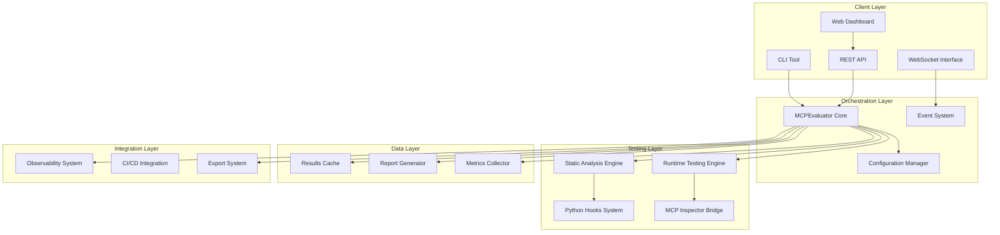
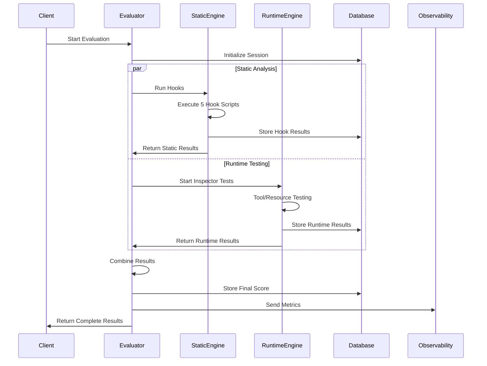

# MCP Testing Evaluation Framework - Technical Documentation

**Comprehensive technical architecture and implementation guide for the MCP Testing Evaluation Framework**

## Table of Contents

1. [System Architecture Overview](#system-architecture-overview)
2. [Component Specifications](#component-specifications)
3. [Data Flow Architecture](#data-flow-architecture)
4. [Module Interactions](#module-interactions)
5. [Configuration Management](#configuration-management)
6. [Deployment Architecture](#deployment-architecture)
7. [Performance Optimization](#performance-optimization)
8. [Troubleshooting Guide](#troubleshooting-guide)

## System Architecture Overview

The MCP Testing Evaluation Framework is a comprehensive Node.js-based system that combines static code analysis with runtime testing to validate MCP (Model Context Protocol) servers against Anthropic's 5 core requirements.



### Core Architecture Principles

1. **Event-Driven Design**: All components communicate through a centralized event system
2. **Modular Architecture**: Clear separation between static analysis and runtime testing
3. **Pluggable Components**: Easy to extend with additional test types or integrations
4. **Real-Time Monitoring**: WebSocket-based live updates for all operations
5. **Multi-Interface Support**: CLI, web dashboard, and programmatic API access

## Component Specifications

### 1. MCPEvaluator Core (`src/evaluator.js`)

**Purpose**: Central orchestrator managing the complete evaluation lifecycle

**Key Features**:
- Event-driven architecture extending Node.js EventEmitter
- Configurable test execution (static-only, runtime-only, combined)
- Automatic server configuration detection
- Comprehensive scoring and recommendation system
- Integration with observability systems

**Technical Specifications**:
```javascript
class MCPEvaluator extends EventEmitter {
  constructor(options = {}) {
    this.serverPath = options.serverPath;
    this.config = {
      runStatic: options.runStatic !== false,
      runRuntime: options.runRuntime !== false,
      transport: options.transport || 'stdio',
      hooksPath: options.hooksPath || '.claude/hooks',
      observabilityUrl: options.observabilityUrl || 'http://localhost:3456',
      timeout: options.timeout || 30000,
      retries: options.retries || 3
    };
  }
}
```

**Event Emission Pattern**:
- `evaluation:started` → Evaluation initialization
- `static:started` → Static analysis phase begins
- `hook:running` → Individual hook execution
- `hook:completed` → Hook completion with results
- `runtime:started` → Runtime testing phase begins
- `tool:testing` → Individual tool test
- `tool:passed/failed` → Tool test results
- `evaluation:completed` → Full evaluation finished
- `evaluation:failed` → Evaluation error occurred

### 2. Inspector Bridge (`src/inspector-bridge.js`)

**Purpose**: Programmatic interface to MCP Inspector for automated runtime testing

**Key Features**:
- Multi-transport support (STDIO, SSE, HTTP)
- Process lifecycle management
- Automated test sequence execution
- Response validation and error detection
- Configurable timeouts and retry logic

**Technical Specifications**:
```javascript
class InspectorBridge extends EventEmitter {
  constructor(options = {}) {
    this.config = {
      inspectorPath: options.inspectorPath || 'npx @modelcontextprotocol/inspector',
      transport: options.transport || 'stdio',
      timeout: options.timeout || 30000,
      port: options.port || 5173,
      retries: options.retries || 3,
      bufferSize: options.bufferSize || 64 * 1024
    };
  }
}
```

**Test Execution Pipeline**:
1. **Server Configuration**: Create temporary config for Inspector
2. **Process Spawning**: Launch Inspector with specific parameters
3. **Connection Establishment**: Wait for server readiness
4. **Test Sequence**: Execute predefined test patterns
5. **Result Collection**: Capture and validate responses
6. **Process Cleanup**: Terminate Inspector gracefully

### 3. CLI Tool (`bin/mcp-evaluate`)

**Purpose**: Command-line interface for automated evaluation and CI/CD integration

**Features**:
- Multiple output formats (text, JSON, HTML)
- Configurable fail thresholds for CI/CD
- Interactive tool testing capabilities
- Verbose logging and debug modes
- Report generation and export

**Command Structure**:
```bash
mcp-evaluate [path] [options]

Options:
  --transport stdio|sse|http    Transport type
  --static-only                 Run static analysis only
  --runtime-only               Run runtime testing only
  --json                       JSON output format
  --report <file>              Generate report file
  --ci                         CI/CD mode with exit codes
  --fail-threshold <score>     Minimum score for success
  --timeout <ms>               Operation timeout
  --verbose                    Enable verbose logging
  --help                       Show usage information
```

### 4. Dashboard Server (`src/dashboard/server.js`)

**Purpose**: Real-time web interface with WebSocket support for live monitoring

**Technical Architecture**:
```javascript
const server = express();
const httpServer = createServer(server);
const io = new Server(httpServer, {
  cors: { origin: "*" },
  transports: ['websocket', 'polling']
});

// WebSocket event handling
io.on('connection', (socket) => {
  socket.on('start-evaluation', handleEvaluationStart);
  socket.on('stop-evaluation', handleEvaluationStop);
  socket.on('get-status', handleStatusRequest);
});
```

**API Endpoints**:
- `POST /api/evaluate` → Start new evaluation
- `GET /api/evaluation/:id` → Get evaluation status
- `GET /api/evaluations` → List all evaluations
- `DELETE /api/evaluation/:id` → Cancel evaluation
- `GET /api/config` → Get system configuration
- `POST /api/config` → Update configuration

## Data Flow Architecture

### Evaluation Lifecycle Data Flow



### Data Processing Pipeline

1. **Input Processing**:
   - Server path validation and normalization
   - Configuration file discovery and parsing
   - Dependency verification and validation

2. **Static Analysis Pipeline**:
   ```
   Python Hooks → JSON Results → Score Calculation → Evidence Collection
   ```

3. **Runtime Testing Pipeline**:
   ```
   Inspector Launch → Tool Discovery → Test Execution → Response Validation
   ```

4. **Results Combination**:
   ```
   Static Results + Runtime Results → Weighted Scoring → Recommendations
   ```

5. **Output Generation**:
   ```
   Combined Results → Report Templates → Multiple Formats (JSON/MD/HTML)
   ```

## Module Interactions

### Hook System Integration

The static analysis system uses Python hooks that follow a standardized interface:

```python
#!/usr/bin/env python3
"""
MCP Evaluation Hook Template
Returns: {"score": float, "evidence": list, "recommendations": list}
"""

def evaluate_requirement(project_path, config=None):
    """
    Main evaluation function
    
    Args:
        project_path: Path to MCP server project
        config: Optional configuration dictionary
        
    Returns:
        dict: Evaluation results with score (0.0-1.0), evidence, recommendations
    """
    try:
        # Implementation specific logic
        score = calculate_score(project_path)
        evidence = collect_evidence(project_path)
        recommendations = generate_recommendations(score, evidence)
        
        return {
            "score": score,
            "evidence": evidence,
            "recommendations": recommendations,
            "timestamp": datetime.now().isoformat()
        }
    except Exception as e:
        return {
            "score": 0.0,
            "evidence": [f"Error: {str(e)}"],
            "recommendations": ["Fix evaluation errors before retesting"],
            "error": True
        }
```

### Inspector Bridge Communication

The Inspector Bridge manages complex inter-process communication:

```javascript
// Inspector Process Management
async startInspector(serverConfig) {
  const configPath = await this.createTempConfig(serverConfig);
  
  this.process = spawn('npx', [
    '@modelcontextprotocol/inspector',
    '--config', configPath,
    '--transport', this.config.transport,
    '--port', this.config.port,
    '--headless'
  ]);
  
  // Setup stdio handlers
  this.process.stdout.on('data', this.handleOutput.bind(this));
  this.process.stderr.on('data', this.handleError.bind(this));
  this.process.on('exit', this.handleExit.bind(this));
  
  return this.waitForReady();
}

// Test Execution
async executeTest(test) {
  const command = {
    method: 'tools/call',
    params: {
      name: test.toolName,
      arguments: test.arguments
    }
  };
  
  return new Promise((resolve, reject) => {
    const timeout = setTimeout(() => {
      reject(new Error(`Test timeout: ${test.toolName}`));
    }, this.config.timeout);
    
    this.sendCommand(command)
      .then(result => {
        clearTimeout(timeout);
        resolve(this.validateResponse(result));
      })
      .catch(error => {
        clearTimeout(timeout);
        reject(error);
      });
  });
}
```

## Configuration Management

### Configuration Hierarchy

The system supports multiple configuration sources with clear precedence:

1. **Command Line Arguments** (highest priority)
2. **Environment Variables**
3. **Project Configuration** (`mcp-evaluator.config.json`)
4. **User Configuration** (`~/.mcp-evaluator.json`)
5. **System Defaults** (lowest priority)

### Configuration Schema

```json
{
  "$schema": "https://json-schema.org/draft/2020-12/schema",
  "type": "object",
  "properties": {
    "inspector": {
      "type": "object",
      "properties": {
        "transport": {
          "type": "string",
          "enum": ["stdio", "sse", "http"]
        },
        "timeout": {
          "type": "integer",
          "minimum": 1000,
          "maximum": 300000
        },
        "retries": {
          "type": "integer",
          "minimum": 0,
          "maximum": 10
        },
        "port": {
          "type": "integer",
          "minimum": 1024,
          "maximum": 65535
        }
      }
    },
    "hooks": {
      "type": "object",
      "properties": {
        "enableAll": {
          "type": "boolean"
        },
        "customPatterns": {
          "type": "array",
          "items": {
            "type": "string"
          }
        },
        "hooksPath": {
          "type": "string"
        }
      }
    },
    "scoring": {
      "type": "object",
      "properties": {
        "weights": {
          "type": "object",
          "properties": {
            "static": {
              "type": "number",
              "minimum": 0,
              "maximum": 1
            },
            "runtime": {
              "type": "number",
              "minimum": 0,
              "maximum": 1
            }
          }
        },
        "thresholds": {
          "type": "object",
          "properties": {
            "pass": {
              "type": "number",
              "minimum": 0,
              "maximum": 1
            },
            "warning": {
              "type": "number",
              "minimum": 0,
              "maximum": 1
            }
          }
        }
      }
    },
    "observability": {
      "type": "object",
      "properties": {
        "enabled": {
          "type": "boolean"
        },
        "url": {
          "type": "string",
          "format": "uri"
        },
        "apiKey": {
          "type": ["string", "null"]
        }
      }
    }
  }
}
```

### Dynamic Configuration Loading

```javascript
class ConfigManager {
  constructor() {
    this.config = {};
    this.watchers = [];
  }
  
  async loadConfiguration(projectPath) {
    const sources = [
      this.loadDefaults(),
      await this.loadUserConfig(),
      await this.loadProjectConfig(projectPath),
      this.loadEnvironmentConfig(),
      this.loadCommandLineConfig()
    ];
    
    this.config = this.mergeConfigurations(sources);
    this.validateConfiguration();
    return this.config;
  }
  
  watchConfiguration(callback) {
    // File system watchers for hot reloading
    const watcher = chokidar.watch([
      'mcp-evaluator.config.json',
      '~/.mcp-evaluator.json'
    ]);
    
    watcher.on('change', () => {
      this.loadConfiguration()
        .then(config => callback(config))
        .catch(error => console.error('Config reload error:', error));
    });
    
    this.watchers.push(watcher);
  }
}
```

## Deployment Architecture

### Local Development Setup

```bash
# Development environment
git clone https://github.com/your-org/multi-agent-observability-system
cd multi-agent-observability-system/apps/mcp-evaluator

# Install dependencies
npm install
pip3 install -r requirements.txt

# Install MCP Inspector
npm install -g @modelcontextprotocol/inspector

# Setup development configuration
cp config/development.json mcp-evaluator.config.json

# Start development server
npm run dev
```

### Production Deployment

```dockerfile
# Multi-stage Docker build for production
FROM node:18-alpine AS builder

WORKDIR /app
COPY package*.json ./
RUN npm ci --only=production

FROM node:18-alpine AS runtime

# Install Python and system dependencies
RUN apk add --no-cache python3 py3-pip

# Create non-root user
RUN addgroup -g 1001 -S evaluator && \
    adduser -S evaluator -u 1001

WORKDIR /app

# Copy application code
COPY --from=builder /app/node_modules ./node_modules
COPY . .

# Install Python dependencies
RUN pip3 install -r requirements.txt

# Install MCP Inspector globally
RUN npm install -g @modelcontextprotocol/inspector

# Set permissions
RUN chown -R evaluator:evaluator /app
USER evaluator

# Health check
HEALTHCHECK --interval=30s --timeout=10s --start-period=60s \
  CMD node healthcheck.js

EXPOSE 3457
CMD ["node", "src/dashboard/server.js"]
```

### Kubernetes Deployment

```yaml
apiVersion: apps/v1
kind: Deployment
metadata:
  name: mcp-evaluator
  labels:
    app: mcp-evaluator
spec:
  replicas: 3
  selector:
    matchLabels:
      app: mcp-evaluator
  template:
    metadata:
      labels:
        app: mcp-evaluator
    spec:
      containers:
      - name: evaluator
        image: mcp-evaluator:latest
        ports:
        - containerPort: 3457
        env:
        - name: NODE_ENV
          value: "production"
        - name: MCP_OBSERVABILITY_URL
          value: "http://observability-service:3456"
        resources:
          requests:
            memory: "256Mi"
            cpu: "250m"
          limits:
            memory: "512Mi"
            cpu: "500m"
        livenessProbe:
          httpGet:
            path: /health
            port: 3457
          initialDelaySeconds: 30
          periodSeconds: 10
        readinessProbe:
          httpGet:
            path: /ready
            port: 3457
          initialDelaySeconds: 5
          periodSeconds: 5
---
apiVersion: v1
kind: Service
metadata:
  name: mcp-evaluator-service
spec:
  selector:
    app: mcp-evaluator
  ports:
    - protocol: TCP
      port: 80
      targetPort: 3457
  type: LoadBalancer
```

## Performance Optimization

### Execution Performance Tuning

1. **Parallel Processing**:
```javascript
// Concurrent hook execution
async runStaticAnalysis() {
  const hooks = this.getActiveHooks();
  
  // Execute hooks in parallel with concurrency limit
  const results = await Promise.allSettled(
    hooks.map(async (hook) => {
      const semaphore = await this.semaphore.acquire();
      try {
        return await this.runHook(hook);
      } finally {
        semaphore.release();
      }
    })
  );
  
  return this.processHookResults(results);
}
```

2. **Caching Strategy**:
```javascript
class ResultsCache {
  constructor(options = {}) {
    this.cache = new Map();
    this.ttl = options.ttl || 3600000; // 1 hour
    this.maxSize = options.maxSize || 1000;
  }
  
  async get(key) {
    const cached = this.cache.get(key);
    if (cached && Date.now() - cached.timestamp < this.ttl) {
      return cached.data;
    }
    this.cache.delete(key);
    return null;
  }
  
  set(key, data) {
    if (this.cache.size >= this.maxSize) {
      const firstKey = this.cache.keys().next().value;
      this.cache.delete(firstKey);
    }
    
    this.cache.set(key, {
      data,
      timestamp: Date.now()
    });
  }
}
```

3. **Memory Management**:
```javascript
// Stream-based processing for large files
async processLargeProject(projectPath) {
  const stream = fs.createReadStream(path.join(projectPath, 'analysis.json'));
  const parser = new StreamingJsonParser();
  
  return new Promise((resolve, reject) => {
    let results = [];
    
    stream
      .pipe(parser)
      .on('data', (chunk) => {
        results.push(this.processChunk(chunk));
        
        // Prevent memory buildup
        if (results.length > 1000) {
          results = this.aggregateResults(results);
        }
      })
      .on('end', () => resolve(results))
      .on('error', reject);
  });
}
```

### Database Optimization

```javascript
// Connection pooling and query optimization
class DatabaseManager {
  constructor(config) {
    this.pool = mysql.createPool({
      connectionLimit: 10,
      host: config.host,
      user: config.user,
      password: config.password,
      database: config.database,
      acquireTimeout: 60000,
      timeout: 60000
    });
  }
  
  async storeEvaluationResults(data) {
    const connection = await this.pool.getConnection();
    
    try {
      await connection.beginTransaction();
      
      // Batch insert for performance
      const evaluationId = await this.insertEvaluation(connection, data.meta);
      
      const hookPromises = data.hooks.map(hook => 
        this.insertHookResult(connection, evaluationId, hook)
      );
      
      await Promise.all(hookPromises);
      await connection.commit();
      
      return evaluationId;
    } catch (error) {
      await connection.rollback();
      throw error;
    } finally {
      connection.release();
    }
  }
}
```

## Troubleshooting Guide

### Common Issues and Solutions

#### 1. MCP Inspector Connection Issues

**Problem**: Inspector fails to connect to MCP server

**Diagnosis**:
```bash
# Check if server starts correctly
node your-server.js

# Verify Inspector installation
npx @modelcontextprotocol/inspector --version

# Test manual connection
npx @modelcontextprotocol/inspector --config ./mcp.json
```

**Solutions**:
- Verify MCP server configuration file exists and is valid
- Check transport type matches server implementation
- Increase timeout values for slow-starting servers
- Verify port availability for network transports

#### 2. Hook Execution Failures

**Problem**: Python hooks fail to execute or return errors

**Diagnosis**:
```bash
# Test hook individually
python3 .claude/hooks/functionality-match.py /path/to/project

# Check Python dependencies
pip3 list | grep -E "(requests|pyyaml|tabulate)"

# Verify hook permissions
ls -la .claude/hooks/*.py
```

**Solutions**:
```bash
# Install missing dependencies
pip3 install requests pyyaml tabulate

# Fix permissions
chmod +x .claude/hooks/*.py

# Reinstall hooks
cp -r /path/to/mcp-hooks .claude/hooks
```

#### 3. Performance Issues

**Problem**: Evaluations running slowly or timing out

**Diagnosis**:
```javascript
// Enable performance monitoring
const evaluator = new MCPEvaluator({
  serverPath: '/path/to/server',
  debug: true,
  timeout: 60000,
  performanceMonitoring: true
});

evaluator.on('performance:metric', (data) => {
  console.log(`${data.operation}: ${data.duration}ms`);
});
```

**Solutions**:
- Increase timeout values in configuration
- Enable caching for repeated evaluations
- Use `--static-only` for faster development cycles
- Optimize MCP server startup time

#### 4. WebSocket Connection Problems

**Problem**: Dashboard loses connection or events don't update

**Diagnosis**:
```javascript
// Client-side debugging
const ws = new WebSocket('ws://localhost:3457/ws');
ws.onopen = () => console.log('Connected');
ws.onerror = (error) => console.error('WebSocket error:', error);
ws.onclose = (event) => console.log('Disconnected:', event.code, event.reason);

// Server-side debugging
io.engine.on("connection_error", (err) => {
  console.log('Connection error:', err.req, err.code, err.message, err.context);
});
```

**Solutions**:
- Check firewall settings and port availability
- Verify CORS configuration for cross-origin requests
- Implement connection retry logic with exponential backoff
- Use polling transport as fallback

#### 5. Memory Leaks and Resource Issues

**Problem**: High memory usage or process crashes

**Diagnosis**:
```bash
# Monitor memory usage
node --inspect --max-old-space-size=4096 src/dashboard/server.js

# Use Node.js memory profiling
node --prof src/evaluator.js
node --prof-process isolate-*.log > profile.txt
```

**Solutions**:
```javascript
// Implement proper cleanup
class MCPEvaluator {
  async cleanup() {
    // Stop all running processes
    if (this.inspector.process) {
      this.inspector.process.kill('SIGTERM');
    }
    
    // Clear caches
    this.cache.clear();
    
    // Remove event listeners
    this.removeAllListeners();
    
    // Close database connections
    if (this.db) {
      await this.db.close();
    }
  }
}

// Graceful shutdown handling
process.on('SIGINT', async () => {
  console.log('Graceful shutdown initiated');
  await evaluator.cleanup();
  process.exit(0);
});
```

### Debug Mode Configuration

Enable comprehensive debugging with environment variables:

```bash
export MCP_DEBUG=true
export MCP_LOG_LEVEL=verbose
export MCP_TRACE_HOOKS=true
export MCP_INSPECTOR_DEBUG=true

# Start with debug logging
mcp-evaluate /path/to/server --verbose 2>&1 | tee debug.log
```

### Log Analysis Tools

```bash
# Extract evaluation timings
grep "duration:" debug.log | awk '{print $3}' | sort -n

# Find error patterns
grep -E "(Error|Failed|Timeout)" debug.log | sort | uniq -c

# Monitor WebSocket events
grep "websocket" debug.log | tail -f

# Hook execution analysis
grep "hook:" debug.log | cut -d' ' -f3- | sort
```

This technical documentation provides a comprehensive foundation for understanding, deploying, and maintaining the MCP Testing Evaluation Framework. For API-specific details, security guidelines, and integration examples, refer to the companion documentation files.