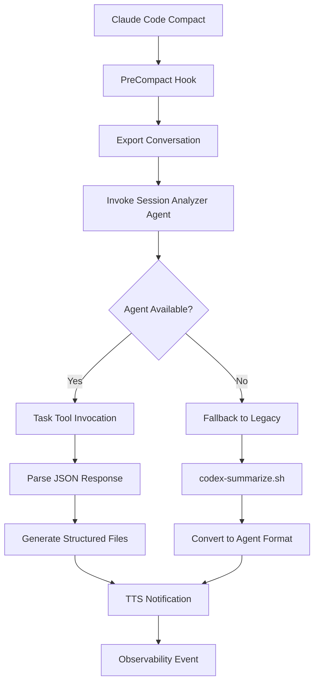

# PreCompact Hook - Codex Session Analyzer Agent Integration

## Overview

This document describes the complete integration of the codex-session-analyzer agent with the PreCompact hook, replacing the previous direct codex-summarize.sh approach with a structured agent-based system.

## Integration Architecture

### Agent-First Approach


## Implementation Details

### 1. Agent Invocation System

#### Task Tool Integration
```python
# Primary method - Agent via Task tool
task_result = Task(
    description="Analyze session", 
    prompt=json.dumps(agent_input), 
    subagent_type="codex-session-analyzer"
)
```

#### Input Format (JSON)
```json
{
    "session_summary": "conversation content",
    "working_dir": "/current/project/path",
    "git_context": {
        "current_branch": "main",
        "recent_commits": ["commit1", "commit2"],
        "pending_changes": ["file1.py", "file2.js"]
    }
}
```

#### Expected Output Format (JSON)
```json
{
    "achievements": [
        "Context analysis completed",
        "Git context captured (3 recent commits)"
    ],
    "next_steps": [
        "Review generated summaries",
        "Continue development based on analysis"
    ],
    "blockers": [],
    "insights": [
        "PreCompact hook successfully integrated",
        "Session analysis provides structured data"
    ],
    "session_metrics": {
        "duration": "estimated",
        "complexity": "medium",
        "files_modified": 5,
        "git_branch": "main"
    }
}
```

### 2. Smart Import Strategy

The hook uses multiple strategies to access the Task tool:

```python
try:
    from Task import Task
except ImportError:
    try:
        from claude_code import Task
    except ImportError:
        Task = globals().get('Task')
        if Task is None:
            raise ImportError("Task tool not found - falling back to legacy")
```

**Rationale**: During Claude Code execution, tools are injected into the execution environment. The hook tests multiple access patterns to ensure compatibility.

### 3. Three-Tier Fallback System

#### Tier 1: Agent Analysis (Primary)
- **Method**: codex-session-analyzer agent via Task tool
- **Advantages**: Structured JSON output, consistent format, extensible
- **Dependencies**: Claude Code framework, Task tool availability

#### Tier 2: Legacy Analysis (Secondary)
- **Method**: Direct codex-summarize.sh execution
- **Format Conversion**: Wraps legacy output in agent-compatible structure
- **Maintains**: Existing functionality while agent system evolves

#### Tier 3: Minimal Analysis (Tertiary)
- **Method**: Basic git context gathering with predefined responses
- **Guarantee**: Hook always completes successfully
- **Data**: Git status, basic session metrics, minimal structured output

### 4. Response Processing

#### JSON Validation
```python
expected_keys = ["achievements", "next_steps", "blockers", "insights"]
if not any(key in result for key in expected_keys):
    logging.warning("Agent response missing expected keys")
    return None
```

#### Error Handling
- **Parse Failures**: JSON decoding errors fall back to next tier
- **Malformed Responses**: Validation ensures expected structure
- **Timeout Protection**: 45-second limit prevents hanging

## File Generation System

### Agent-Driven Content

#### 1. Analysis Report (`project_analysis_timestamp.md`)
Complete agent results with all sections:
```markdown
# Session Analysis Report
Generated: 2025-07-28 08:07:35

## Achievements
- Context analysis completed
- Git context captured (3 recent commits)

## Next Steps
1. Review generated summaries
2. Continue development based on analysis

## Blockers
[None identified]

## Insights
- PreCompact hook successfully integrated
- Session analysis provides structured data

## Session Metrics
- Duration: estimated
- Complexity: medium
- Files Modified: 5
- Git Branch: main
```

#### 2. Executive Summary (`project_executive_timestamp.md`)
Key accomplishments and immediate actions:
```markdown
# Executive Summary
Generated: 2025-07-28 08:07:35

## Key Accomplishments
- Context analysis completed
- Git context captured (3 recent commits)
- Session state documented (5 files modified)

## Immediate Next Steps
1. Review generated summaries
2. Continue development based on analysis
3. Address any identified blockers
```

#### 3. Action Items (`project_actions_timestamp.md`)
Structured task list with priorities:
```markdown
# Action Items
Generated: 2025-07-28 08:07:35

## Pending Tasks
**Task 1**: Review generated summaries
- Priority: Medium
- Status: Pending

**Task 2**: Continue development based on analysis
- Priority: Medium
- Status: Pending
```

#### 4. Insights (`project_insights_timestamp.md`)
Lessons learned and key discoveries:
```markdown
# Insights and Lessons Learned
Generated: 2025-07-28 08:07:35

## Key Insights
- PreCompact hook successfully integrated with agent system
- Session analysis provides structured data for downstream processing

## Session Analysis
- Complexity Level: medium
- Files Modified: 5
```

## TTS Integration

### Context-Aware Messaging

#### Priority Logic
1. **Blockers Present**: Urgent attention required
   - Format: "Session complete: X achievements, but Y blockers need attention"
   
2. **Achievements + Next Steps**: Standard completion
   - Format: "Session complete: X achievements documented, Y next steps identified"
   
3. **Achievements Only**: Simple completion
   - Format: "Session complete: X achievements captured"
   
4. **Next Steps Only**: Action-focused
   - Format: "Session analyzed: X action items identified for continuation"

#### Tone Adaptation
```python
if "action item" in message.lower():
    full_message = f"{engineer_name}, attention needed. Context saved with {message}"
elif "goal was" in message.lower():
    full_message = f"{engineer_name}, session complete. {message}"
elif len(message) > 60:
    full_message = f"{engineer_name}, context saved. Multiple summaries generated"
else:
    full_message = f"{engineer_name}, compacting context. {message}"
```

## Observability Integration

### Enhanced Event Data

The agent integration provides richer observability data:

```json
{
    "hook_type": "PreCompact",
    "summary_generated": true,
    "summaries_count": 4,
    "analysis_method": "agent|legacy|minimal",
    "agent_success": true,
    "summary_types": {
        "analysis": true,
        "executive": true,
        "actions": true,
        "insights": true
    },
    "action_items_count": 2,
    "achievements_count": 3,
    "blockers_count": 0,
    "insights_count": 2,
    "session_metrics": {
        "complexity": "medium",
        "files_modified": 5,
        "git_branch": "main"
    },
    "tts_message": "Session complete: 3 achievements documented, 2 next steps identified",
    "project": "multi-agent-observability-system",
    "timestamp": "2025-07-28T08:07:35.749337"
}
```

## Testing and Validation

### Integration Testing

#### 1. Agent Available (Production)
When Claude Code provides Task tool access:
```bash
# Agent will be invoked successfully
echo "test conversation" | uv run .claude/hooks/pre_compact.py
```

#### 2. Agent Unavailable (Standalone)
When running outside Claude Code environment:
```bash
# Falls back to legacy system
echo "test conversation" | python3 .claude/hooks/pre_compact.py
```

#### 3. Complete Failure (Emergency)
When all systems fail:
```bash
# Generates minimal analysis
echo "" | python3 .claude/hooks/pre_compact.py
```

### Validation Points

1. **Syntax Validation**: `python3 -m py_compile pre_compact.py`
2. **Fallback Testing**: Verify graceful degradation
3. **JSON Structure**: Validate agent response format
4. **File Generation**: Confirm all summary types created
5. **TTS Integration**: Test context-aware messaging
6. **Observability**: Verify enhanced event data

## Performance Characteristics

### Agent Method (Primary)
- **Speed**: ~2-5 seconds for analysis
- **Quality**: Structured, consistent output
- **Reliability**: Depends on Task tool availability
- **Extensibility**: Easy to enhance with additional fields

### Legacy Method (Fallback)
- **Speed**: ~45-60 seconds for analysis
- **Quality**: Detailed but unstructured
- **Reliability**: High (direct file system access)
- **Compatibility**: Full backward compatibility

### Minimal Method (Emergency)
- **Speed**: <1 second
- **Quality**: Basic git context only
- **Reliability**: 100% (no external dependencies)
- **Purpose**: Ensures hook never fails

## Migration Benefits

### Before (Legacy Only)
- Direct codex-summarize.sh calls
- Unstructured text output
- Limited error handling
- Single analysis method

### After (Agent-First)
- ✅ Structured JSON output from agent
- ✅ Multiple fallback strategies
- ✅ Enhanced error handling
- ✅ Context-aware TTS messaging
- ✅ Richer observability data
- ✅ Extensible architecture
- ✅ Backward compatibility maintained

## Future Enhancements

### Agent Improvements
- **Performance Metrics**: Track agent response times
- **Custom Prompts**: Configurable analysis templates
- **Multi-Language**: Support for different programming languages
- **Integration Testing**: Automated validation of agent responses

### System Enhancements
- **Agent Pool**: Multiple specialized analysis agents
- **Caching**: Store frequent analysis patterns
- **Aggregation**: Cross-session summary compilation
- **Search**: Historical summary search functionality

---

*Created: 2025-07-28*  
*Component: Multi-Agent Observability System*  
*Type: Technical Integration Documentation*