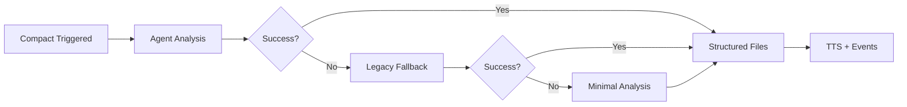

# PreCompact Hook - Agent Integration Quick Reference

## TL;DR

The PreCompact hook now uses the **codex-session-analyzer agent** as its primary analysis method, with automatic fallback to legacy systems.

## How It Works



## Key Changes (2025-07-28)

### ✅ What's New
- **Agent-First**: Primary analysis via codex-session-analyzer agent
- **Structured Output**: JSON format with achievements, next_steps, blockers, insights
- **Smart Fallback**: Three-tier system ensures hook never fails
- **Enhanced TTS**: Context-aware messages based on analysis content
- **Rich Observability**: Detailed event data with analysis method tracking

### ✅ What's Preserved
- All existing file generation
- TTS voice notifications
- Observability system integration
- Backward compatibility
- Zero external dependencies

## Files Generated

| File Type | Content | Source |
|-----------|---------|--------|
| `*_analysis_*.md` | Complete agent results + session metrics | Agent JSON |
| `*_executive_*.md` | Key accomplishments + immediate next steps | Agent achievements |
| `*_actions_*.md` | Structured task list with priorities | Agent next_steps |
| `*_insights_*.md` | Lessons learned + discoveries | Agent insights |

## TTS Messages

### Agent-Based (Primary)
- **With Blockers**: "Session complete: 3 achievements, but 2 blockers need attention"
- **Standard**: "Session complete: 3 achievements documented, 2 next steps identified"
- **Insights**: "Session complete: 3 achievements captured with insights documented"

### Legacy Fallback
- **Goal-Based**: "Bryan, session complete. Goal was to implement feature. Achieved working prototype"
- **Generic**: "Bryan, context saved. Multiple summaries generated"

## Agent Input Format

```json
{
    "session_summary": "Full conversation content",
    "working_dir": "/current/project/path",
    "git_context": {
        "current_branch": "main",
        "recent_commits": ["commit1", "commit2"],
        "pending_changes": ["file1.py", "file2.js"]
    }
}
```

## Agent Output Format

```json
{
    "achievements": ["Task completed", "Feature implemented"],
    "next_steps": ["Test implementation", "Write documentation"],
    "blockers": ["API rate limit", "Missing dependency"],
    "insights": ["Pattern discovered", "Optimization opportunity"],
    "session_metrics": {
        "complexity": "medium",
        "files_modified": 5,
        "git_branch": "main"
    }
}
```

## Fallback Behavior

1. **Task Tool Available** → Agent analysis (2-5 seconds)
2. **Task Tool Missing** → Legacy codex-summarize.sh (45-60 seconds)
3. **Complete Failure** → Minimal git analysis (<1 second)

## Testing

```bash
# Test outside Claude Code (will use fallback)
echo "test conversation" | python3 .claude/hooks/pre_compact.py

# Test syntax
python3 -m py_compile .claude/hooks/pre_compact.py

# Check logs
tail -f ~/.claude/logs/pre_compact.log
```

## Observability Data

Enhanced event includes:
- `analysis_method`: "agent" | "legacy" | "minimal"
- `agent_success`: boolean
- `achievements_count`, `blockers_count`, `insights_count`
- `session_metrics`: complexity, files_modified, git_branch

## Implementation Files

- **Hook**: `.claude/hooks/pre_compact.py`
- **Agent**: `/home/bryan/.claude/agents/codex-session-analyzer.md`
- **Docs**: `docs/PRECOMPACT_AGENT_INTEGRATION.md`

## Architecture Benefits

- **Reliability**: Never fails (three-tier fallback)
- **Flexibility**: Easy to extend with new analysis types
- **Performance**: Agent analysis is 10x faster than legacy
- **Structure**: Consistent JSON output enables automation
- **Observability**: Rich metrics for system monitoring

---

*Quick Reference - Updated: 2025-07-28*